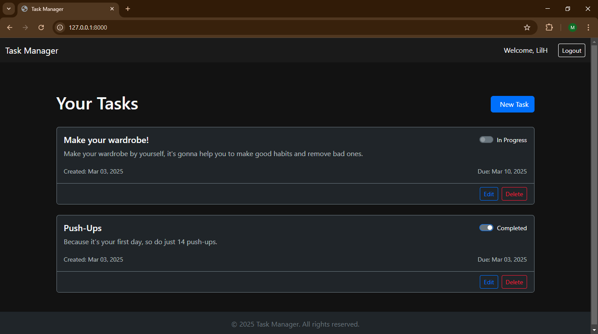

# Task Manager Web Application 🚀



A modern task management web application built with Django and Bootstrap 5, featuring a sleek dark theme interface. You can organize your tasks efficiently with CRUD operations, status tracking, and user authentication.

[](https://www.djangoproject.com/)
[](https://getbootstrap.com/)
[](https://www.python.org/)

## ✨ Features

- **Task Management**: Create, Read, Update, and Delete tasks
- **User Authentication**: Secure login/register system
- **Status Tracking**: Mark tasks as complete/in-progress
- **Dark Theme**: Eye-friendly interface for extended use
- **Responsive Design**: Works on all screen sizes
- **Due Date Tracking**: Never miss deadlines
- **Form Validation**: Error handling for user inputs
- **CSRF Protection**: Secure form submissions

## 🛠️ Tech Stack

### Frontend
- **Bootstrap 5**: Modern responsive design
- **Bootstrap Icons**: Crisp iconography
- **CSS3**: Custom dark theme styling

### Backend
- **Django**: Robust web framework
- **SQLite**: Database management
- **Django-Bootstrap5**: Form rendering and styling

## 🚀 Installation

1. Clone repository:
   ```bash
   git clone https://github.com/hussain-jawaid/task_manager
